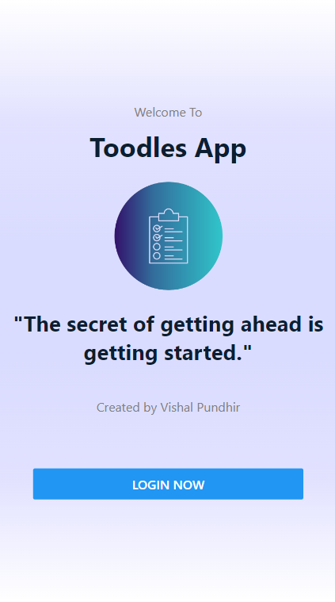

# toodlesApp-Documentation

[Deployed API](https://toodlesapp.onrender.com)

View the [Source Code](https://github.com/VishalMX3/toodlesApp).

### Running the app

To run on pc web browser install node modules after cloning to your local pc

```bash
yarn
```

Run on _web_ using

```bash
yarn web
```

This will also show you a QR code in terminal which can be used in _Expo App_ to run the app on _mobile_. Run either by scanning the QR code or enter the url manually (also found in the terminal)

> Note: If running on pc, please run using inspect mode (iPhone SE dimensions) for best performance

## App Overview

There are 3 tabs - home, calendar and profile.

`Home` - View tasks for today, add tasks, mark them as completed/pending, view category-wise tasks. Tasks are saved on mongoDB database specific for each user.

`Calendar tab` - Shows us the tasks completed for a particular date.

`Profile Tab` - Shows a statistics of total tasks, total pending tasks and total completed tasks. Logout functionality here.

## User registration and login authorization

Created two endpoints `/register` and `/login` in REST API.

User Register - User info is sent to /register endpoint where it get saved in the MongoDB cloud database using the _User_ Model. The password is saved in encrypted form using CryptoJS library.


User Login - User info is sent to /login endpoint where it finds the user by email and checks for correct password. On successful login the API sends back a unique authorization token (using JWT sign) and user info which we store in `AsyncStorage` of the device user is using.

```javascript
axios
  .post("https://toodlesapp.onrender.com/login", user)
  .then((response) => {
    const token = response.data.token;
    AsyncStorage.setItem("authToken", token);
    AsyncStorage.setItem("user", JSON.stringify(response.data.user));
    dispatch(loginSuccess(response.data));
    router.replace("/(tabs)/home");
  })
  .catch((error) => {
    dispatch(loginFailure());
    console.log(error);
  });
```

We create a `useEffect` in welcome screen to check if we already have a token and user in `AsyncStorage` then we are gonna show the user home screen directly (no need of logging in again). This token is cleared only when user logs out.

```javascript
useEffect(() => {
  const checkLoginStatus = async () => {
    try {
      const token = await AsyncStorage.getItem("authToken");
      const user = JSON.parse(await AsyncStorage.getItem("user"));
      if (token !== null && user !== null) {
        dispatch(loginSuccess({ user, token }));
        router.replace("/(tabs)/home");
      }
    } catch (error) {
      console.log(error);
    }
  };
  checkLoginStatus();
}, [dispatch]);
```

## Integrating Redux for State Management and CRUD operataions on tasks

- Used react-redux and @reduxjs/toolkit toolkit.
- Created global states for `user` and `todos` that can be accessed from a global store.

```javascript
import { configureStore } from "@reduxjs/toolkit";
import todoReducer from "./todoRedux";
import userReducer from "./userRedux";

export default configureStore({
  reducer: {
    todos: todoReducer,
    user: userReducer,
  },
});
```

- Implemented createSlice feauture from @reduxjs/toolkit and useSelector and useDispatch hooks from react-redux.

```javascript
import { createSlice } from "@reduxjs/toolkit";

export const todoSlice = createSlice({
  name: "todos",
  initialState: {
    todos: [],
    isFetching: false,
    error: false,
  },
  reducers: {
    //GET
    getTodosStart: (state) => {
      state.isFetching = true;
      state.error = false;
    },
    getTodosSuccess: (state, action) => {
      state.isFetching = false;
      state.todos = action.payload;
    },
    getTodosFailure: (state, action) => {
      state.isFetching = false;
      state.error = true;
    },
```

Similar reducers are created for all CRUD operations for tasks.

## API Deployment

The backend API is deployed on render cloud service provider.
https://toodlesapp.onrender.com/

> Note: The free instance of this api spins down with inactivity, which can delay requests by 50 seconds or more.

## Screenshots of working application

 
 
 
